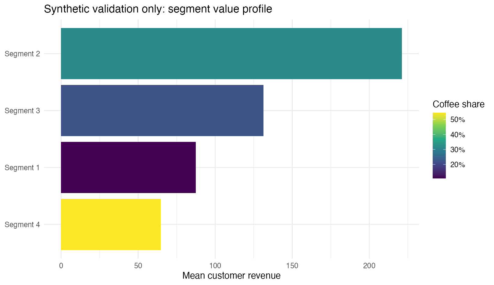
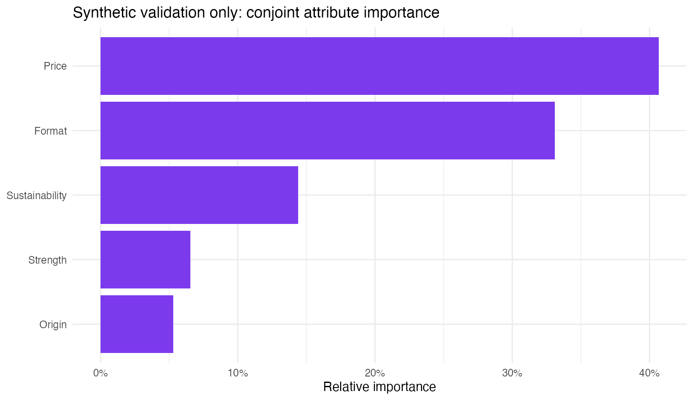

# Retail Customer & Product Strategy in R

This project combines customer value, behavioural segmentation and product-design analysis to identify a target segment and evaluate the attributes of a proposed coffee product.

The project combines RFM analysis, clustering, prospect classification, conjoint analysis, preference simulation and PCA. Together, these methods connect customer value, segment choice, product attributes and competitive positioning.

## Commercial problem

A retail product decision has several layers: identify the customers worth serving, understand the attributes they value, position the concept against alternatives and decide how much confidence to place in a simulated preference share. This project connects those layers instead of treating segmentation, conjoint and positioning as unrelated techniques.

## What I built

I created customer-level recency, frequency and monetary measures, compared a four-cluster behavioural solution, interpreted the target segment, estimated conjoint part-worths and attribute importance, simulated concept preference and used PCA to map competitive positioning. The workflow exports the customer and product decision tables behind each recommendation.

## Project evidence

The submitted analysis covered **925 customers** and reported:

- total revenue of **£101,728.60**;
- coffee revenue of **£16,154.17**;
- a four-segment customer solution;
- conjoint importance led by format at **44.5%** and price at **31.1%**;
- a simulated **32.0%** share for the proposed concept.

The included demonstration data reproduces the analytical workflow and keeps simulated preference outcomes distinct from realised sales performance.



## Decision flow

```text
transaction history
      |
      v
RFM customer value + four behavioural clusters
      |
      v
target segment definition
      |
      +--> conjoint part-worths and attribute importance
      +--> concept utility and share simulation
      `--> PCA competitive positioning
      |
      v
evidence-based product, price, channel and promotion choices
```

## Decision interpretation

The analysis separates exploratory customer segments from predictive claims, keeps conjoint coefficients and attribute importance traceable, and treats the simulated market share as a preference scenario rather than a sales forecast. It can identify a plausible target segment and product configuration, but a launch decision would still require concept testing, cost and margin data, distribution feasibility and a controlled market trial.



## Repository guide

| Path | Purpose |
|---|---|
| `R/generate_demo_data.R` | Synthetic transactions, conjoint responses and product profiles |
| `R/run_analysis.R` | RFM, clustering, conjoint, simulation and PCA |
| `outputs/` | Customer and product decision tables |
| `figures/` | Segment and product visuals |
| `tests/validate_results.R` | Grain and reconciliation checks |

## Limitations

RFM clusters describe observed purchasing patterns; they do not prove future response. Conjoint utilities come from stated preferences and are sensitive to design and sample quality. The market-share output is a controlled preference simulation, not a commercial forecast.

## Author

**Muhammad Ahmed Shoaib**<br>
Retail analytics, customer segmentation and commercial decision support.
